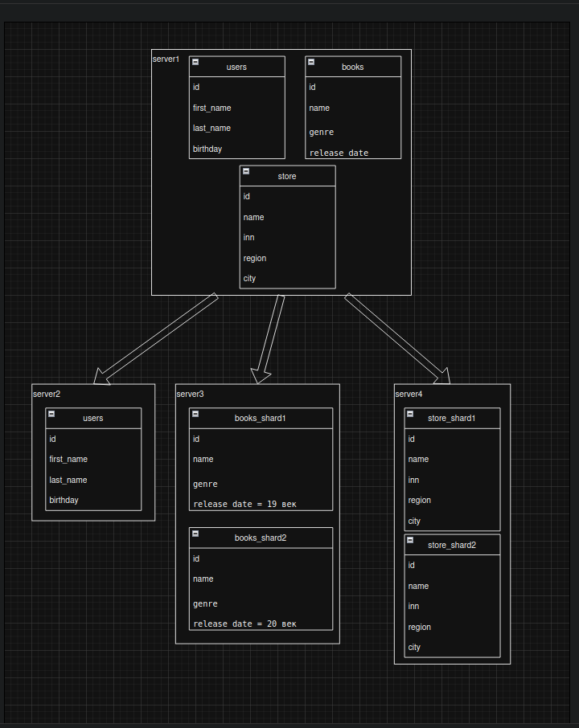

# Домашнее задание к занятию «Репликация и масштабирование. Часть 2» Бетко Алексей

### Задание 1

Опишите основные преимущества использования масштабирования методами:

- активный master-сервер и пассивный репликационный slave-сервер; 
- master-сервер и несколько slave-серверов;

### Ответ

1. Отказоустойчивость, можно переключаться с мастера на слейв в случае выхода из строя мастера.
2. Доступ для чтения, чем больше slave серверов, тем больше точек чтения

---

### Задание 2

Разработайте план для выполнения горизонтального и вертикального шаринга базы данных. База данных состоит из трёх таблиц: 

- пользователи, 
- книги, 
- магазины (столбцы произвольно). 

Опишите принципы построения системы и их разграничение или разбивку между базами данных.

### Ответ

Для начала стоит применить горизонтальное шардирование к базе, которая находится на  server1, что бы все таблицы были размещены на разных серверах. Ну а дальше в зависимости от таблицы применить вертикальное шардирование, например магазины очень хорошо делятся на регионы, а книги по дате выпуска или жанру. Таблицу с пользователями не трогал, но к ней так же  можно применить шардировать например по году рождения, но обычно там не большое колличество пользователей и их распределение будет не сбалансированное. 

Схема

